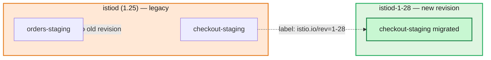
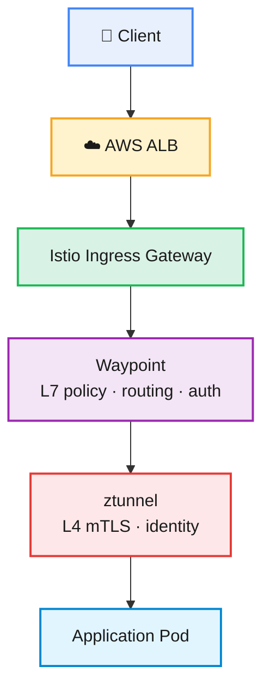

# Architecture and Upgrade Strategy

## Why Revision-Based Upgrades Exist (and Why You Should Care)

Before ambient mode, upgrading Istio meant upgrading `istiod` in place and hoping the new version's Envoy config generation didn't break anything for the sidecars still running the old proxy image. It usually worked. "Usually" is not a word you want near your mesh control plane.

Revision-based upgrades sidestep this by letting you install a **second, independent `istiod`** — say, `istiod-1-28` — that runs next to the existing one. Nothing routes through it until you explicitly label a namespace to use that revision. This gives you three things a straight in-place upgrade can't:

- **Parallel control planes.** The old and new `istiod` both watch the cluster and generate config independently. A bug in the new version's config generation doesn't touch namespaces still pinned to the old revision.
- **Namespace-by-namespace cutover.** You move one team's namespace, watch it for a bit, then move the next. If something's wrong, you flip the label back.
- **A clean rollback path.** Because the old control plane is still running (not yet deleted), rolling back is a label change, not a redeploy.

The trade-off is operational complexity — you're running two control planes for a while, and you need to be disciplined about which tool manages what. Which brings up the second rule this project follows religiously.

*Both control planes run at the same time. `checkout-staging` has already been relabeled and moved to `istiod-1-28` (green), while `orders-staging` (orange) is still safely served by the legacy control plane until its team is ready to cut over.*

> **Key principle:** Helm manages lifecycle components — CRDs, `istiod`, ztunnel, the CNI plugin, gateways. `istioctl` is only used for traffic objects (waypoints) and diagnostics. Mixing install methods for the same resource is the single most common way people end up with orphaned webhooks or duplicate ownership conflicts mid-upgrade.

## The Architecture You're Upgrading

Ambient mode's biggest architectural shift from sidecar mode is that **application pods stop running a proxy container entirely**. Traffic gets redirected at the node level instead.

*Every hop from the ALB down to the pod is color-coded by responsibility — gateway (green) hands off to the waypoint (purple) for L7 decisions, which hands off to ztunnel (red) for the actual mTLS-secured hop into the pod (blue). No sidecar container in sight.*

| Component | Responsibility |
|---|---|
| Istiod | Control plane — config distribution, certificate issuance |
| ztunnel | Per-node L4 proxy handling mTLS and workload identity |
| Waypoint | L7 policy enforcement, authorization, routing |
| Istio CNI | Redirects pod traffic into ztunnel at the node level |
| Ingress Gateway | North–south traffic entry point |
| Helm | Lifecycle management for control and data plane components |
| istioctl | Traffic objects (waypoints), diagnostics |

One thing worth internalizing here: because there's no sidecar, a pod can join the mesh's L4 security boundary (mTLS, identity) the moment ztunnel picks it up — no pod restart required. L7 features need a waypoint, which is a separate, explicitly deployed proxy per namespace or service account. That split is *the* reason ambient migrations can be this incremental.

## Starting State (this walkthrough's environment)

| Item | Value |
|---|---|
| Kubernetes | EKS 1.32 |
| Istio version | 1.25 (installed via `istioctl`) |
| Mesh mode | Ambient |
| Ingress | istioctl-managed gateway |
| ztunnel / Waypoints | Enabled |

Target: Istio 1.28, fully Helm-managed, same ambient mode, same ingress endpoint — just swapped out underneath without anyone downstream noticing.

> **Note:** This pattern — parallel control planes, adopt-then-upgrade, namespace-by-namespace cutover — works for any Istio upgrade, not just this version pair. We're demonstrating it on 1.25 → 1.28; other jumps may need minor tweaks to chart values or CRDs, so cross-check the [Istio upgrade docs](https://istio.io/latest/docs/setup/upgrade/) for your specific versions.

---

⬅ [Back to README](../README.md) &nbsp;|&nbsp; ➡ [Next: Migration Walkthrough](02-migration-walkthrough.md)
